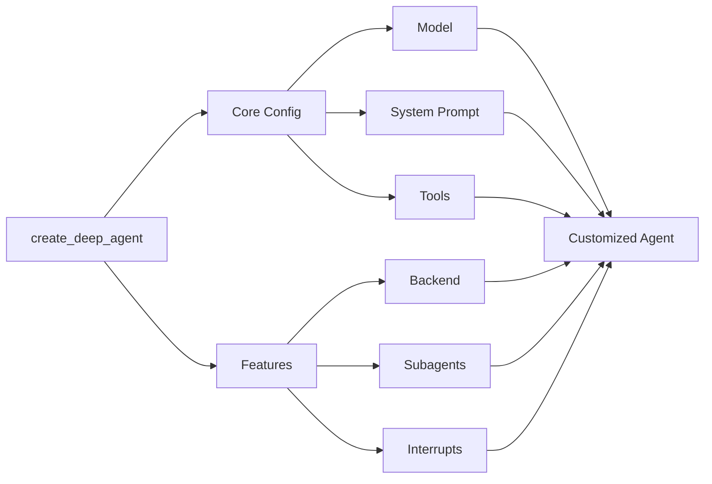

## Model

By default, `deepagents` uses [`claude-sonnet-4-5-20250929`](https://platform.claude.com/docs/en/about-claude/models/overview). You can customize the model used by passing any supported <Tooltip tip="A string that follows the format `provider:model` (e.g. openai:gpt-5)" cta="See mappings" href="https://reference.langchain.com/python/langchain/models/#langchain.chat_models.init_chat_model(model)">model identifier string</Tooltip> or [LangChain model object](/oss/javascript/integrations/chat).

<Tip>
    Use the `provider:model` format (e.g., `openai:gpt-5`) to quickly switch between models.
</Tip>


```typescript
import { ChatAnthropic } from "@langchain/anthropic";
import { ChatOpenAI } from "@langchain/openai";
import { createDeepAgent } from "deepagents";

// Using Anthropic
const agent = createDeepAgent({
  model: new ChatAnthropic({
    model: "claude-sonnet-4-20250514",
    temperature: 0,
  }),
});

// Using OpenAI
const agent2 = createDeepAgent({
  model: new ChatOpenAI({
    model: "gpt-5",
    temperature: 0,
  }),
});
```


## System prompt

Deep agents come with a built-in system prompt inspired by Claude Code's system prompt. The default system prompt contains detailed instructions for using the built-in planning tool, file system tools, and subagents.

Each deep agent tailored to a use case should include a custom system prompt specific to that use case.


```typescript
import { createDeepAgent } from "deepagents";

const researchInstructions = `You are an expert researcher. Your job is to conduct thorough research, and then write a polished report.`;

const agent = createDeepAgent({
  systemPrompt: researchInstructions,
});
```


## Tools

In addition to custom tools you provide, deep agents include [built-in tools](/oss/javascript/deepagents/overview#core-capabilities) for planning, file management, and subagent spawning.


```typescript
import { tool } from "langchain";
import { TavilySearch } from "@langchain/tavily";
import { createDeepAgent } from "deepagents";
import { z } from "zod";

const internetSearch = tool(
  async ({
    query,
    maxResults = 5,
    topic = "general",
    includeRawContent = false,
  }: {
    query: string;
    maxResults?: number;
    topic?: "general" | "news" | "finance";
    includeRawContent?: boolean;
  }) => {
    const tavilySearch = new TavilySearch({
      maxResults,
      tavilyApiKey: process.env.TAVILY_API_KEY,
      includeRawContent,
      topic,
    });
    return await tavilySearch._call({ query });
  },
  {
    name: "internet_search",
    description: "Run a web search",
    schema: z.object({
      query: z.string().describe("The search query"),
      maxResults: z.number().optional().default(5),
      topic: z
        .enum(["general", "news", "finance"])
        .optional()
        .default("general"),
      includeRawContent: z.boolean().optional().default(false),
    }),
  },
);

const agent = createDeepAgent({
  tools: [internetSearch],
});
```


## Skills

You can use [skills](/oss/javascript/deepagents/overview) to provide your deep agent with new capabilities and expertise.
While [tools](/oss/javascript/deepagents/customization#tools) tend to cover lower level functionality like native file system actions or planning, skills can contain detailed instructions on how to complete tasks, reference info, and other assets, such as templates.
These files are only loaded by the agent when the agent has determined that the skill is useful for the current prompt.
This progressive disclosure reduces the amount of tokens and context the agent has to consider upon startup.

For example skills, see [Deep Agent example skills](https://github.com/langchain-ai/deepagentsjs/tree/main/examples/skills).

To add skills to your deep agent, pass them as an argument to `create_deep_agent`:


<Tabs>
  <Tab title="StateBackend">

    ```typescript
    import { createDeepAgent, type FileData } from "deepagents";
    import { MemorySaver, Command } from "@langchain/langgraph";
    import { createInterface } from "node:readline/promises";
    import { stdin as input, stdout as output } from "node:process";

    const checkpointer = new MemorySaver();

    function createFileData(content: string): FileData {
    const now = new Date().toISOString();
    return {
        content: content.split("\n"),
        created_at: now,
        modified_at: now,
    };
    }

    const skillsFiles: Record<string, FileData> = {};

    const skillUrl =
    "https://raw.githubusercontent.com/langchain-ai/deepagentsjs/refs/heads/main/examples/skills/langgraph-docs/SKILL.md";
    const response = await fetch(skillUrl);
    const skillContent = await response.text();

    skillsFiles["/skills/langgraph-docs/SKILL.md"] = createFileData(skillContent);

    const agent = await createDeepAgent({
    checkpointer,
    // IMPORTANT: deepagents skill source paths are virtual (POSIX) paths relative to the backend root.
    skills: ["/skills/"],
    });

    const config = {
    configurable: {
        thread_id: `thread-${Date.now()}`,
    },
    };

    let result = await agent.invoke(
    {
        messages: [
        {
            role: "user",
            content: "what is langraph? Use the langgraph-docs skill if available.",
        },
        ],
        files: skillsFiles,
    } as any,
    config
    );
    ```

  </Tab>
  <Tab title="StoreBackend">

    ```typescript
    import { createDeepAgent, StoreBackend, type FileData } from "deepagents";
    import {
    InMemoryStore,
    MemorySaver,
    type BaseStore,
    } from "@langchain/langgraph";

    const checkpointer = new MemorySaver();
    const store = new InMemoryStore();

    function createFileData(content: string): FileData {
    const now = new Date().toISOString();
    return {
        content: content.split("\n"),
        created_at: now,
        modified_at: now,
    };
    }

    const skillUrl =
    "https://raw.githubusercontent.com/langchain-ai/deepagentsjs/refs/heads/main/examples/skills/langgraph-docs/SKILL.md";

    const response = await fetch(skillUrl);
    const skillContent = await response.text();
    const fileData = createFileData(skillContent);

    await store.put(["filesystem"], "/skills/langgraph-docs/SKILL.md", fileData);

    const backendFactory = (config: { state: unknown; store?: BaseStore }) => {
    return new StoreBackend({
        state: config.state,
        store: config.store ?? store,
    });
    };

    const agent = await createDeepAgent({
    backend: backendFactory,
    store: store,
    checkpointer,
    // IMPORTANT: deepagents skill source paths are virtual (POSIX) paths relative to the backend root.
    skills: ["/skills/"],
    });

    const config = {
    configurable: {
        thread_id: `thread-${Date.now()}`,
    },
    };

    let result = await agent.invoke(
    {
        messages: [
        {
            role: "user",
            content: "what is langraph? Use the langgraph-docs skill if available.",
        },
        ],
    },
    config
    );
    ```

  </Tab>
  <Tab title="FilesystemBackend">

    ```typescript
    import {
    createDeepAgent,
    createSkillsMiddleware,
    createSettings,
    FilesystemBackend,
    } from "deepagents";
    import { MemorySaver } from "@langchain/langgraph";

    const settings = createSettings({
    });

    const agent = await createDeepAgent({
    backend: (config) =>
        new FilesystemBackend({ rootDir: "/Users/user/{project}" }),
    skills: [path.join(process.cwd(), ".deepagents/skills")],
    interruptOn: {
        read_file: true,
        write_file: true,
        delete_file: true,
    },
    checkpointer, // Required!
    });

    const config = {
    configurable: {
        thread_id: `thread-${Date.now()}`,
    },
    };

    let result = await agent.invoke(
    {
        messages: [
        {
            role: "user",
            content: "what is langraph? Use the langgraph-docs skill if available.",
        },
        ]
    } as any,
    config
    );
    ```

  </Tab>
</Tabs>


## Memory

Use [`AGENTS.md` files](https://agents.md/) to provide extra context to your deep agent.

You can pass one or more file paths to the `memory` parameter when creating your deep agent:


<Tabs>
  <Tab title="StateBackend">
    ```typescript
    import { createDeepAgent, type FileData } from "deepagents";
    import { MemorySaver } from "@langchain/langgraph";

    const AGENTS_MD_URL =
    "https://raw.githubusercontent.com/langchain-ai/deepagents/refs/heads/master/examples/text-to-sql-agent/AGENTS.md";

    async function fetchText(url: string): Promise<string> {
    const res = await fetch(url);
    if (!res.ok) {
        throw new Error(`Failed to fetch ${url}: ${res.status} ${res.statusText}`);
    }
    return await res.text();
    }

    const agentsMd = await fetchText(AGENTS_MD_URL);
    const checkpointer = new MemorySaver();

    function createFileData(content: string): FileData {
    const now = new Date().toISOString();
    return {
        content: content.split("\n"),
        created_at: now,
        modified_at: now,
    };
    }

    const agent = await createDeepAgent({
    memory: ["/AGENTS.md"],
    checkpointer: checkpointer,
    });

    const result = await agent.invoke(
    {
        messages: [
        {
            role: "user",
            content: "Please tell me what's in your memory files.",
        },
        ],
        // Seed the default StateBackend's in-state filesystem (virtual paths must start with "/").
        files: { "/AGENTS.md": createFileData(agentsMd) },
    } as any,
    { configurable: { thread_id: "12345" } }
    );
    ```
  </Tab>
  <Tab title="StoreBackend">
    ```typescript
    import { createDeepAgent, StoreBackend, type FileData } from "deepagents";
    import {
    InMemoryStore,
    MemorySaver,
    type BaseStore,
    } from "@langchain/langgraph";

    const AGENTS_MD_URL =
    "https://raw.githubusercontent.com/langchain-ai/deepagents/refs/heads/master/examples/text-to-sql-agent/AGENTS.md";

    async function fetchText(url: string): Promise<string> {
    const res = await fetch(url);
    if (!res.ok) {
        throw new Error(`Failed to fetch ${url}: ${res.status} ${res.statusText}`);
    }
    return await res.text();
    }

    const agentsMd = await fetchText(AGENTS_MD_URL);

    function createFileData(content: string): FileData {
    const now = new Date().toISOString();
    return {
        content: content.split("\n"),
        created_at: now,
        modified_at: now,
    };
    }

    const store = new InMemoryStore();
    const fileData = createFileData(agentsMd);
    await store.put(["filesystem"], "/AGENTS.md", fileData);

    const checkpointer = new MemorySaver();

    const backendFactory = (config: { state: unknown; store?: BaseStore }) => {
    return new StoreBackend({
        state: config.state,
        store: config.store ?? store,
    });
    };

    const agent = await createDeepAgent({
    backend: backendFactory,
    store: store,
    checkpointer: checkpointer,
    memory: ["/AGENTS.md"],
    });

    const result = await agent.invoke(
    {
        messages: [
        {
            role: "user",
            content: "Please tell me what's in your memory files.",
        },
        ],
    },
    { configurable: { thread_id: "12345" } }
    );
    ```
  </Tab>
  <Tab title="Filesystem">
    ```typescript
    import { createDeepAgent, FilesystemBackend } from "deepagents";
    import { MemorySaver } from "@langchain/langgraph";

    // Checkpointer is REQUIRED for human-in-the-loop
    const checkpointer = new MemorySaver();

    const agent = await createDeepAgent({
    backend: (config) =>
        new FilesystemBackend({ rootDir: "/Users/user/{project}" }),
    memory: ["./AGENTS.md", "./.deepagents/AGENTS.md"],
    interruptOn: {
        read_file: true,
        write_file: true,
        delete_file: true,
    },
    checkpointer, // Required!
    });
    ```
  </Tab>
</Tabs>

---

<Callout icon="pen-to-square" iconType="regular">
    [Edit this page on GitHub](https://github.com/langchain-ai/docs/edit/main/src/oss/deepagents/customization.mdx) or [file an issue](https://github.com/langchain-ai/docs/issues/new/choose).
</Callout>
<Tip icon="terminal" iconType="regular">
    [Connect these docs](/use-these-docs) to Claude, VSCode, and more via MCP for real-time answers.
</Tip>
