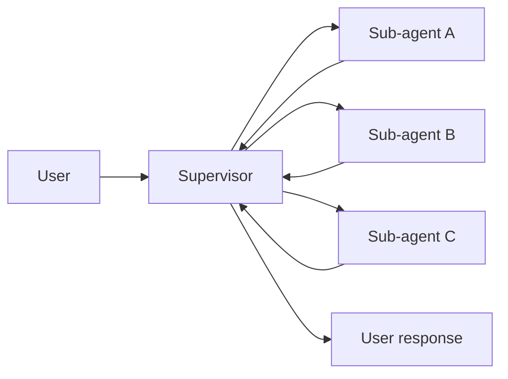
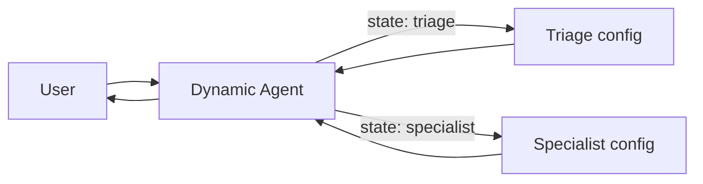
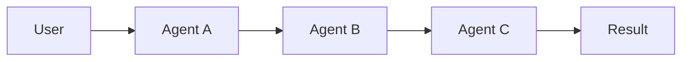
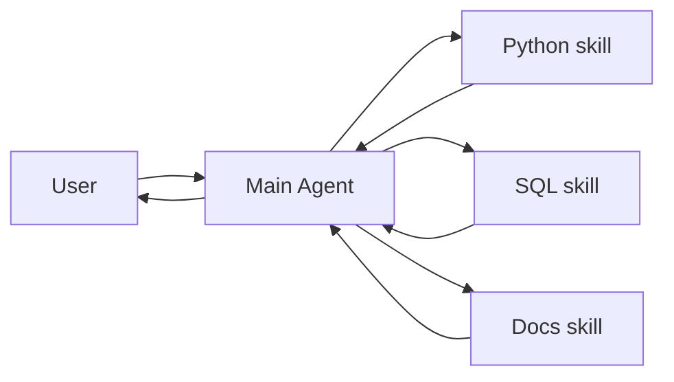

**Multi-agent systems** break a complex application into multiple specialized agents that work together to solve problems.
Instead of relying on a single agent to handle every step, **multi-agent architectures** allow you to compose smaller, focused agents into a coordinated workflow.

Multi-agent systems are useful when:

* A single agent has too many [tools](/oss/javascript/langchain/tools) and makes poor decisions about which to use.
* [Context](/oss/javascript/concepts/context) or [memory](/oss/javascript/langchain/short-term-memory) grows too large for one agent to track effectively.
* Tasks require **specialization** (e.g., a planner, researcher, math expert).
* You need to **enforce sequential constraints** — unlocking capabilities only after certain conditions are met.
* Different teams need to **develop and maintain agents independently**.

## Architectures

There are four main architectures for building multi-agent systems, each suited to different use cases:

| Architecture | How it works | Best for |
|--------------|--------------|----------|
| [**Supervisor**](#supervisor) | A central agent calls sub-agents as tools | Task orchestration, parallel execution |
| [**Dynamic agent**](#dynamic-agent) | One agent with dynamically changing prompts/tools based on state | Multi-stage conversations, sequential unlocking |
| [**Workflow**](#workflow) | Agents connected via deterministic transitions | Pipelines, structured processing |
| [**Skills**](#skills) | Specialized prompts invoked on-demand | Progressive disclosure, team distribution |

<Tip>
    You can mix architectures! For example, a **supervisor** can manage **workflow** sub-graphs, or a **dynamic agent** can invoke **skills** at certain stages.
</Tip>

### Supervisor

In the **supervisor** architecture, a central supervisor agent coordinates sub-agents by calling them as tools. The supervisor decides which sub-agent to invoke, what input to provide, and how to combine results.



**Key characteristics:**

* **Centralized control**: All routing passes through the supervisor
* **Sub-agents as tools**: Each sub-agent is wrapped as a callable tool
* **No direct user interaction**: Sub-agents return results to the supervisor, not the user
* **Parallel execution**: The supervisor can invoke multiple sub-agents in a single turn

#### When to use

Use the supervisor pattern when:

* You have **multiple distinct domains** (e.g., calendar, email, CRM, database)
* Sub-agents **don't need to converse directly** with users
* You need to **coordinate multiple sub-agents** in a single pass
* You want **centralized workflow control**

For simpler cases with just a few tools, use a single agent. Below are some examples:

- **Personal assistant**: Supervisor coordinates calendar, email, and task management sub-agents
- **Research assistant**: Supervisor orchestrates web search, document analysis, and synthesis sub-agents
- **Data analysis platform**: Supervisor routes queries to SQL, Python, and visualization sub-agents

<Card
    title="Tutorial: Build a supervisor agent"
    icon="sitemap"
    href="/oss/javascript/langchain/supervisor"
    arrow cta="Learn more"
>
    Learn how to build a personal assistant using the supervisor pattern, where a central supervisor agent coordinates specialized worker agents.
</Card>


#### Example

The example below shows how a main agent is given access to a single sub-agent via a tool definition:


```typescript
import { createAgent, tool } from "langchain";
import * as z from "zod";

const subagent1 = createAgent({...});

const callSubagent1 = tool(
  async ({ query }) => {
    const result = await subagent1.invoke({
      messages: [{ role: "user", content: query }]
    });
    return result.messages.at(-1)?.text;
  },
  {
    name: "subagent1_name",
    description: "subagent1_description",
    schema: z.object({
      query: z.string().describe("The query to to send to subagent1."),
    }),
  }
);

const agent = createAgent({
  model,
  tools: [callSubagent1]
});
```


In this pattern:

1. The main agent invokes `call_subagent1` when it decides the task matches the sub-agent's description.
2. The sub-agent runs independently and returns its result.
3. The main agent receives the result and continues orchestration.

#### Where to customize

There are several points where you can control how context is passed between the main agent and its subagents:

1. **Sub-agent name** (`"subagent1_name"`): This is how the main agent refers to the sub-agent. Since it influences prompting, choose it carefully.
2. **Sub-agent description** (`"subagent1_description"`): This is what the main agent knows about the sub-agent. It directly shapes how the main agent decides when to call it.
3. **[Input to the sub-agent](#control-the-input-to-the-sub-agent)**: You can customize this input to better shape how the sub-agent interprets tasks. In the example above, we pass the agent-generated `query` directly.
4. **[Output from the sub-agent](#control-the-output-from-the-sub-agent)**: This is the response passed back to the main agent. You can adjust what is returned to control how the main agent interprets results. In the example above, we return the final message text, but you could return additional state or metadata.

##### Control the input to the sub-agent

There are two main levers to control the input that the main agent passes to a sub-agent:

* **Modify the prompt**: Adjust the main agent's prompt or the tool metadata (i.e., sub-agent's name and description) to better guide when and how it calls the sub-agent.
* **Context injection**: Add input that isn't practical to capture in a static prompt (e.g., full message history, prior results, task metadata) by adjusting the tool call to pull from the agent's state.


```typescript
import { createAgent, tool, AgentState, ToolMessage } from "langchain";
import { Command } from "@langchain/langgraph";
import * as z from "zod";

// Example of passing the full conversation history to the sub agent via the state.
const callSubagent1 = tool(
  async ({query}) => {
    const state = getCurrentTaskInput<AgentState>();
    // Apply any logic needed to transform the messages into a suitable input
    const subAgentInput = someLogic(query, state.messages);
    const result = await subagent1.invoke({
      messages: subAgentInput,
      // You could also pass other state keys here as needed.
      // Make sure to define these in both the main and subagent's
      // state schemas.
      exampleStateKey: state.exampleStateKey
    });
    return result.messages.at(-1)?.content;
  },
  {
    name: "subagent1_name",
    description: "subagent1_description",
  }
);
```


##### Control the output from the sub-agent

Two common strategies for shaping what the main agent receives back from a sub-agent:

* **Modify the prompt**: Refine the sub-agent's prompt to specify exactly what should be returned.
  * Useful when outputs are incomplete, too verbose, or missing key details.
  * A common failure mode is that the sub-agent performs tool calls or reasoning but does **not include the results** in its final message. Remind it that the controller (and user) only see the final output, so all relevant info must be included there.
* **Custom output formatting**: Adjust or enrich the sub-agent's response in code before handing it back to the main agent.
  * Example: pass specific state keys back to the main agent in addition to the final text.
  * This requires wrapping the result in a [`Command`](https://reference.langchain.com/javascript/classes/_langchain_langgraph.index.Command.html) (or equivalent structure) so you can merge custom state with the sub-agent's response.


```typescript
import { tool, ToolMessage } from "langchain";
import { Command } from "@langchain/langgraph";
import * as z from "zod";

const callSubagent1 = tool(
  async ({ query }, config) => {
    const result = await subagent1.invoke({
      messages: [{ role: "user", content: query }]
    });

    // Return a Command to update multiple state keys
    return new Command({
      update: {
        // Pass back additional state from the subagent
        exampleStateKey: result.exampleStateKey,
        messages: [
          new ToolMessage({
            content: result.messages.at(-1)?.text,
            tool_call_id: config.toolCall?.id!
          })
        ]
      }
    });
  },
  {
    name: "subagent1_name",
    description: "subagent1_description",
    schema: z.object({
      query: z.string().describe("The query to send to subagent1")
    })
  }
);
```


### Dynamic agent

In the **dynamic agent** architecture, you have a single agent whose behavior (prompt, tools, and capabilities) changes dynamically based on state. This creates a state machine where each "stage" represents a different agent configuration.



**Key characteristics:**

* **Single agent, multiple configurations**: The agent identity changes based on state
* **State-driven behavior**: Prompts and tools are selected based on a state variable (e.g., `active_agent`)
* **Direct user interaction**: The active agent configuration handles user messages directly
* **Persistent state**: State survives across conversation turns

#### When to use

Use the dynamic agent pattern when:

* You need to **enforce sequential constraints** — unlock capabilities only after preconditions are met
* Sub-agents need to **converse directly with the user**
* You want to **update prompts and tools** based on conversation progress
* You're building **multi-stage conversational flows**

This pattern is particularly valuable for **"online"** customer support scenarios where you need to collect information in a specific sequence:

* Collecting a warranty ID before processing a refund
* Gathering account details before escalating to a specialist
* Verifying identity before accessing sensitive information

Below are some examples:

- **Customer support chatbot**: Triage agent collects information, then hands off to specialist
- **Onboarding flows**: Account setup → preference collection → feature tour
- **Multi-domain chat**: General conversation → technical support → sales

<Card
    title="Tutorial: Build a customer support agent with handoffs"
    icon="people-arrows"
    href="/oss/javascript/langchain/customer-support-handoffs"
    arrow cta="Learn more"
>
    Learn how to build a customer support workflow using the dynamic agent pattern, where agents pass control through state transitions.
</Card>


<Tip>
    Design dynamic agent flows carefully to avoid creating rigid, frustrating experiences. Users should be able to:
    * Correct typos or mistakes in previously provided information.
    * Change the conversation flow when appropriate.
    * Navigate back to previous steps if needed.

    Overly restrictive flows can feel like poorly designed phone trees.
</Tip>

#### How it works

At the core, the dynamic agent pattern relies on [persistent state](/oss/javascript/langchain/short-term-memory) that survives across conversation turns:

1. **State variable**: A field in your state schema (e.g., `active_agent: str`) tracks which agent configuration is currently active.
2. **State update tool**: The agent uses a tool to change the value of `active_agent` when transitioning to a new stage.
3. **Dynamic configuration**: On each turn, the graph entry point reads `active_agent` from the persisted state and dynamically configures the appropriate system prompt, tools, and behavior.

This pattern creates a state machine where each configuration represents a distinct state with its own behavior and capabilities.

#### Example

Here's an example showing how agents transition between configurations:


```typescript
import { tool, createAgent, AgentState } from "langchain";
import { Command } from "@langchain/langgraph";

const SupportState = z.object({
  currentAgent: z.string().default("triage")
});

const transferToSpecialist = tool(
  async (_, config) => {
    return new Command({
      update: { currentAgent: "specialist" }
    });
  },
  {
    name: "transfer_to_specialist",
    description: "Transfer conversation to a specialist",
    schema: z.object({})
  }
);

const agent = createAgent({
  model,
  tools: [transferToSpecialist, ...],
  stateSchema: SupportState
});
```


The key mechanism is using [`Command`](https://reference.langchain.com/javascript/classes/_langchain_langgraph.index.Command.html) to update state fields that control which agent configuration is active. Middleware can then read this state and dynamically configure the agent's behavior.

#### Best practices

When implementing dynamic agents:

1. **Bound message histories**: Use @[`trim_messages`] or @[`@before_model`] [middleware](/oss/javascript/langchain/short-term-memory#trim-messages) to prevent unbounded growth.
2. **State for cross-agent memory**: Store structured data (warranty status, issue type) in @[`AgentState`] [custom state](/oss/javascript/langchain/short-term-memory#customizing-agent-memory), not message history.
3. **Inject context summaries**: Add state information to system prompts so each configuration knows what previous stages learned.
4. **Validate state transitions**: Check required state exists before allowing transitions to later stages.
5. **Allow backward navigation**: Provide @[`@tool`]s that return [`Command`](https://reference.langchain.com/javascript/classes/_langchain_langgraph.index.Command.html) objects for users to correct mistakes and return to previous stages.
6. **Ensure valid message sequences**: Make sure message histories follow provider requirements (user → AI → tool alternation).
7. **Use checkpointers**: Always include a [`InMemorySaver`](https://reference.langchain.com/javascript/classes/_langchain_langgraph-checkpoint.MemorySaver.html) [checkpointer](/oss/javascript/langchain/short-term-memory#usage) to persist state across turns.


### Workflow

In the **workflow** architecture, agents are connected via deterministic transitions defined at graph construction time. The flow between agents is explicit and predictable.



**Key characteristics:**

* **Deterministic flow**: Transitions are defined explicitly via graph edges
* **Predictable execution**: You always know which agent runs next
* **No LLM routing decisions**: The graph structure controls flow, not LLM calls
* **Pipeline-style processing**: Each agent processes and passes to the next

#### When to use

Use the workflow pattern when:

* You have a **fixed sequence** of processing steps
* Agents are **independent** and don't need to be aware of each other
* You want **predictable, debuggable** execution
* You're building **processing pipelines** (e.g., extract → transform → load)

Below are some examples:

- **Content pipeline**: Research → draft → edit → publish
- **Data processing**: Extract → validate → transform → load
- **Document processing**: Parse → classify → extract entities → summarize

#### Example

This example shows a content pipeline where each node is a full agent with its own tools:


```typescript
import { StateGraph, MessagesAnnotation, START } from "@langchain/langgraph";
import { createAgent } from "langchain";

// Create specialized agents for each stage
const researchAgent = createAgent({
  model: "openai:gpt-4o",
  tools: [webSearch, fetchUrl],
  prompt: "You are a research assistant. Search for and gather relevant information on the topic.",
  name: "researcher"
});

const writingAgent = createAgent({
  model: "openai:gpt-4o",
  tools: [createOutline, writeSection],
  prompt: "You are a writer. Create content based on the research provided.",
  name: "writer"
});

const editingAgent = createAgent({
  model: "openai:gpt-4o",
  tools: [checkGrammar, checkStyle],
  prompt: "You are an editor. Refine and improve the content for clarity and correctness.",
  name: "editor"
});

// Define the workflow with explicit edges
const workflow = new StateGraph(MessagesAnnotation)
  .addNode("research", researchAgent)
  .addNode("write", writingAgent)
  .addNode("edit", editingAgent)
  .addEdge(START, "research")
  .addEdge("research", "write")
  .addEdge("write", "edit")
  .compile();

const result = await workflow.invoke({
  messages: [{ role: "user", content: "Write an article about AI agents" }]
});
```


### Skills

In the **skills** architecture, specialized capabilities are packaged as invokable "skills" that augment an agent's behavior. Skills are primarily prompt-driven specializations that an agent can invoke on-demand.



**Key characteristics:**

* **Prompt-driven specialization**: Skills are primarily defined by specialized prompts
* **Progressive disclosure**: Skills become available based on context or user needs
* **Team distribution**: Different teams can develop and maintain skills independently
* **Lightweight composition**: Skills are simpler than full sub-agents

#### When to use

Use the skills pattern when:

* You want a **single agent with many possible specializations**
* You **don't need to enforce specific constraints** between skills
* Different **teams need to develop capabilities independently**
* You want **progressive disclosure** — reveal capabilities as needed

Below are some examples:

- **Coding assistant**: Skills for different languages, frameworks, or tasks (debugging, refactoring, testing)
- **Knowledge base**: Skills for different domains (legal, medical, technical)
- **Creative assistant**: Skills for different formats (email, report, presentation)

<Note>
Skills documentation is coming soon. This pattern is being developed as part of the [deep-agents](https://github.com/langchain-ai/deep-agents) project.
</Note>


## Choosing an architecture

Use this guide to select the right architecture:

```
Do sub-agents need to converse directly with users?
├── Yes → Do you need to enforce sequential constraints?
│         ├── Yes → Dynamic agent
│         └── No → Skills
└── No → Do you need deterministic flow between agents?
         ├── Yes → Workflow
         └── No → Supervisor
```

**Additional considerations:**

| Question | If yes, consider... |
|----------|---------------------|
| Do sub-agents need to be invoked in parallel? | Supervisor |
| Do you need to persist state for sub-agents? | Dynamic agent (or stateful tools in Supervisor) |
| Do you want agents developed independently by different teams? | Skills |
| Do you need predictable, debuggable execution? | Workflow |
| Do you want to coordinate multiple sub-agents in one pass? | Supervisor (or Skills if no constraints) |

<Note>
**Non-blocking sub-agent execution**

Currently, LangGraph doesn't have built-in support for non-blocking sub-agent execution. If you have a use case that requires this (e.g., kicking off a long-running sub-agent and continuing with other work), please [file an issue](https://github.com/langchain-ai/langgraph/issues) describing your use case.

One possible approach is using the LangGraph API server with loopback calls — exposing tools that allow an agent to start a run and check on its status asynchronously.
</Note>


## Communication between agents

Regardless of architecture, you need to decide how agents communicate. The key questions are:

### What information is passed between agents?

* **Full message history**: Agents share their complete thought process (scratchpad)
    * **Pro**: Better reasoning, more context for decisions
    * **Con**: Context can grow quickly, may need memory management

* **Final results only**: Agents share only their conclusions
    * **Pro**: Cleaner context, better scaling
    * **Con**: Loss of intermediate reasoning

### How is state managed?

* **Shared state**: All agents read/write to the same state object
    * Best for: Tightly coupled agents that need to coordinate

* **Isolated state**: Each agent has its own state, explicitly passed between agents
    * Best for: Independent agents, cleaner boundaries

### How are transitions represented?

When using tool-based transitions (e.g., handoff tools in dynamic agents), you need to handle the LLM's tool call message. Most providers require tool calls to have corresponding tool result messages. Options:

1. **Add a tool message**: "Successfully transferred to Agent X" (most common)
2. **Remove the tool call message**: Filter it from history before the next agent sees it


## Customize agent context

At the center of multi-agent design is **[context engineering](/oss/javascript/langchain/context-engineering)** - deciding what information each agent sees. LangChain gives you fine-grained control over:

* Which parts of the conversation or state are passed to each agent.
* Specialized prompts tailored to sub-agents.
* Inclusion/exclusion of intermediate reasoning.
* Customizing input/output formats per agent.

The quality of your system depends on context engineering. The goal is to ensure that each agent has access to the correct data it needs to perform its task, whether it's acting as a tool or as an active agent.

---

<Callout icon="pen-to-square" iconType="regular">
    [Edit the source of this page on GitHub.](https://github.com/langchain-ai/docs/edit/main/src/oss/langchain/multi-agent.mdx)
</Callout>
<Tip icon="terminal" iconType="regular">
    [Connect these docs programmatically](/use-these-docs) to Claude, VSCode, and more via MCP for real-time answers.
</Tip>
