import ChatModelTabsPy from '/snippets/chat-model-tabs.mdx';
import ChatModelTabsJs from '/snippets/chat-model-tabs-js.mdx';

This tutorial shows how to use **progressive disclosure** - a context management technique where the agent loads information on-demand rather than upfront - to implement **skills** (specialized prompt-based instructions). The agent discovers and loads only the skills it needs for each task.

**What you'll build:** An employee support agent with two skills (expense reporting and travel booking). The agent sees lightweight skill descriptions in its system prompt, then loads full skill content through tool calls only when relevant to the user's query.

**Why progressive disclosure:**
- **Reduces context usage** - load only the 2-3 skills needed for a task, not all available skills
- **Enables team autonomy** - different teams can develop specialized skills independently (similar to other multi-agent architectures)
- **Scales efficiently** - add dozens or hundreds of skills without overwhelming context
- **Simplifies conversation history** - single agent with one conversation thread

**What are skills:** Skills, as popularized by Claude Code, are primarily prompt-based: self-contained units of specialized instructions for specific business tasks. In Claude Code, skills are exposed as directories with files on the file system, discovered through file operations. Skills guide behavior through prompts and can provide information about tool usage or include sample code for a coding agent to execute.

**Trade-offs:** Progressive disclosure requires additional tool calls to load skills, which can introduce noticeable latency depending on your architecture. With basic implementations, you cannot enforce workflow constraints (e.g., skill A must be tried before skill B) - you rely on prompting alone.

<Tip>
**Implementing your own skills system**

When building your own skills implementation (as we do in this tutorial), the core concept is progressive disclosure - loading information on-demand. Beyond that, you have full flexibility in implementation:

- **Storage**: databases, S3, in-memory data structures, or any backend
- **Discovery**: direct lookup (this tutorial), RAG for large skill collections, file system scanning, or API calls
- **Loading logic**: customize latency characteristics and add logic to search through skill content or rank relevance
- **Side effects**: define what happens when a skill loads, such as exposing tools associated with that skill (covered in section 8)

This flexibility lets you optimize for your specific requirements around performance, storage, and workflow control.
</Tip>

## Architecture overview

Here's how progressive disclosure with skills works:

```mermaid
%%{init: {'theme':'base', 'themeVariables': { 'primaryColor':'#4CAF50','primaryTextColor':'#fff','primaryBorderColor':'#2E7D32','lineColor':'#666','secondaryColor':'#FF9800','tertiaryColor':'#2196F3','tertiaryBorderColor':'#1565C0','tertiaryTextColor':'#fff'}}}%%
flowchart TD
    Start([💬 User Query]) --> SystemPrompt[📋 Skill descriptions<br/>in system prompt]

    SystemPrompt --> Decide{🤔 Which skill<br/>is relevant?}

    Decide --> LoadSkill[🔧 Call load_skill<br/>tool]

    LoadSkill --> Enriched[✨ Full skill content<br/>added to context]

    Enriched --> Solve[💡 Apply skill<br/>to answer]

    Solve --> Response([✅ Response])

    %% Styling for light and dark modes
    classDef startEnd fill:#4CAF50,stroke:#2E7D32,stroke-width:2px,color:#fff
    classDef process fill:#FF9800,stroke:#E65100,stroke-width:2px,color:#fff
    classDef decision fill:#2196F3,stroke:#1565C0,stroke-width:2px,color:#fff
    classDef enrichment fill:#9C27B0,stroke:#6A1B9A,stroke-width:2px,color:#fff

    class Start,Response startEnd
    class SystemPrompt,LoadSkill,Solve process
    class Decide decision
    class Enriched enrichment
```



## Setup

### Installation

This tutorial requires the `langchain` package:


<CodeGroup>
```bash npm
npm install langchain
```
```bash yarn
yarn add langchain
```
```bash pnpm
pnpm add langchain
```
</CodeGroup>


For more details, see our [Installation guide](/oss/javascript/langchain/install).

### LangSmith

Set up [LangSmith](https://smith.langchain.com) to inspect what is happening inside your agent. Then set the following environment variables:


<CodeGroup>
```bash bash
export LANGSMITH_TRACING="true"
export LANGSMITH_API_KEY="..."
```
```typescript typescript
process.env.LANGSMITH_TRACING = "true";
process.env.LANGSMITH_API_KEY = "...";
```
</CodeGroup>


### Components

We will need to select a chat model from LangChain's suite of integrations:


<ChatModelTabsJs />


## 1. Define skills

First, define the structure for skills. Each skill has a name, a brief description (shown in the system prompt), and full content (loaded on-demand):

```python
from typing import TypedDict

class Skill(TypedDict):
    """A skill that can be progressively disclosed to the agent."""
    name: str  # Unique identifier for the skill
    description: str  # Brief description shown in system prompt (1-2 sentences)
    content: str  # Full skill content with detailed instructions
```

Now define example skills for an employee support agent. The skills are designed to be **lightweight in description** (shown to the agent upfront) but **detailed in content** (loaded only when needed):

<Accordion title="View complete skill definitions">

```python
SKILLS: list[Skill] = [
    {
        "name": "expense_reporting",
        "description": "Handles expense report submission, approval workflows, and reimbursement status inquiries.",
        "content": """# Expense Reporting Skill

You help employees with expense reports. You can:

1. **Submit expense reports**: Guide employees through submitting new expense reports
   - Required fields: date, amount, category, description, receipt
   - Categories: travel, meals, supplies, software, other
   - Receipts must be attached for expenses over $25

2. **Check status**: Look up the status of submitted expense reports
   - Pending: awaiting manager approval
   - Approved: approved and queued for payment
   - Paid: reimbursement processed
   - Rejected: needs revision (check rejection reason)

3. **Approval workflows**: Expenses under $100 auto-approve, over $100 need manager approval

Always be specific about next steps and timelines (payments process weekly on Fridays).""",
    },
    {
        "name": "travel_booking",
        "description": "Handles flight and hotel bookings, travel policy questions, and itinerary management.",
        "content": """# Travel Booking Skill

You help employees book business travel. You can:

1. **Book flights**: Help find and book flights within travel policy
   - Must use preferred airlines: United, Delta, American
   - Economy class for flights under 5 hours
   - Business class allowed for international flights over 5 hours
   - Book at least 14 days in advance when possible

2. **Book hotels**: Help find and book hotels within travel policy
   - Per night limit: $200 in most cities, $300 in high-cost cities (NYC, SF, LA, DC)
   - Must use corporate booking portal for best rates
   - Preferred hotel chains: Marriott, Hilton, Hyatt

3. **Travel policy**: Answer questions about travel policy, expense limits, and approval requirements

Always verify trip dates, destination, and get manager approval before booking.""",
    },
]
```

</Accordion>

## 2. Create skill discovery tools

Create a function to list available skills (we'll call this to build the system prompt) and a tool to load full skill content on-demand:

```python
from langchain.tools import tool

def list_available_skills() -> str:
    """Format skill descriptions for the system prompt.

    Returns a string listing all available skills with their brief descriptions.
    """
    skills_list = []
    for skill in SKILLS:
        skills_list.append(f"- **{skill['name']}**: {skill['description']}")
    return "\n".join(skills_list)


@tool
def load_skill(skill_name: str) -> str:
    """Load the full content of a skill into the agent's context.

    Use this when you need detailed information about how to handle a specific
    type of request. This will provide you with comprehensive instructions,
    policies, and guidelines for the skill area.

    Args:
        skill_name: The name of the skill to load (e.g., "expense_reporting", "travel_booking")
    """
    # Find the requested skill
    skill = next((s for s in SKILLS if s["name"] == skill_name), None)

    if skill is None:
        available = ", ".join(s["name"] for s in SKILLS)
        return f"Skill '{skill_name}' not found. Available skills: {available}"

    # Return the full skill content
    return f"Loaded skill: {skill_name}\n\n{skill['content']}"
```

The `list_available_skills()` function formats the lightweight skill descriptions that we'll inject into the system prompt. The `load_skill` tool returns the full skill content as a string, which becomes part of the conversation as a ToolMessage.

## 3. Build skill middleware

Create middleware that injects skill descriptions into the system prompt. This middleware makes skills discoverable without loading their full content upfront:

```python
from langchain.agents.middleware import wrap_model_call, ModelRequest, ModelResponse
from typing import Callable

class SkillMiddleware:
    """Middleware that injects skill descriptions into the system prompt."""

    # Register the load_skill tool as a class variable
    tools = [load_skill]

    def __init__(self, skills_prompt: str):
        """Initialize with the skills prompt addendum.

        Args:
            skills_prompt: Formatted string describing available skills
        """
        self.skills_prompt = skills_prompt

    @wrap_model_call
    async def awrap_model_call(
        self,
        request: ModelRequest,
        handler: Callable[[ModelRequest], ModelResponse],
    ) -> ModelResponse:
        """Async: Inject skill descriptions into system prompt."""
        # Append skill descriptions to the system prompt
        enhanced_prompt = f"{request.system_prompt}\n\n## Available Skills\n\n{self.skills_prompt}\n\nUse the load_skill tool when you need detailed information about handling a specific type of request."

        # Override the system prompt
        request = request.override(system_prompt=enhanced_prompt)

        return await handler(request)

    @wrap_model_call
    def wrap_model_call(
        self,
        request: ModelRequest,
        handler: Callable[[ModelRequest], ModelResponse],
    ) -> ModelResponse:
        """Sync: Inject skill descriptions into system prompt."""
        # Append skill descriptions to the system prompt
        enhanced_prompt = f"{request.system_prompt}\n\n## Available Skills\n\n{self.skills_prompt}\n\nUse the load_skill tool when you need detailed information about handling a specific type of request."

        # Override the system prompt
        request = request.override(system_prompt=enhanced_prompt)

        return handler(request)
```

The middleware appends skill descriptions to the system prompt, making the agent aware of available skills without loading their full content. The `load_skill` tool is registered as a class variable, making it available to the agent.

## 4. Create the agent with skill support

[PLACEHOLDER: Show create_agent configured with the skill middleware, base tools (skill discovery tools), a state schema that tracks loaded_skills, and a checkpointer for persistence across conversation turns.]

## 5. Test progressive disclosure

[PLACEHOLDER: Interactive example demonstrating the progressive disclosure flow. A user asks about expense reports, the agent sees skill descriptions and decides to load the expense_reporting skill, calls load_skill("expense_reporting") to retrieve full skill content, and then uses that knowledge to answer the question. Show the context difference before and after skill loading to illustrate the progressive disclosure mechanism.]

## 6. Add multiple skills

[PLACEHOLDER: Show an example where the agent needs to use multiple skills together. The user asks a compound question that requires both travel_booking and expense_reporting capabilities. The agent discovers and loads both skills, then coordinates between them to provide a comprehensive answer.]

## 7. Implement context cleanup

[PLACEHOLDER: Optional section demonstrating context management techniques. Show how to track context size, determine when to trigger summarization, unload skills that are no longer needed, and use middleware to automatically manage context as conversations grow longer.]

## 8. Advanced: Enforce tools per skill with middleware

[PLACEHOLDER: Show how to use custom middleware to enforce that certain tools are only available when specific skills are loaded. This goes beyond the basic prompt-based approach and adds rigid constraints. Example: when the expense_reporting skill is loaded, register expense-specific tools like submit_expense_report or check_expense_status. The middleware can track loaded_skills in state and conditionally register tools based on which skills are active.]

## 9. Team-based skill development

[PLACEHOLDER: Best practices section covering how to structure skill definitions to enable team autonomy, establish skill interface conventions, test individual skills in isolation, version and update skills without breaking existing agents, and organize skills in a centralized library or registry that multiple teams can contribute to.]

## Complete example

[PLACEHOLDER: Full runnable script combining all the pieces]

## Implementation variations

This tutorial implemented skills as in-memory Python dictionaries loaded through tool calls. However, there are several ways to implement progressive disclosure with skills:

**Storage backends:**
- **In-memory** (this tutorial): Skills defined as Python data structures, fast access, no I/O overhead
- **File system** (Claude Code approach): Skills as directories with files, discovered via file operations like `read_file`
- **Remote storage**: Skills in S3, databases, or APIs, fetched on-demand
- **Hybrid**: Skill descriptions in-memory, full content fetched from remote storage

**Discovery mechanisms:**
- **Direct loading**: If skills are small, load them directly without separate discovery steps
- **Two-phase**: List available skills first, then load specific ones (used in this tutorial)
- **File-based**: Discover skills by scanning directories (Claude Code approach)
- **Registry-based**: Query a skill registry service for available skills

**Size considerations:**
- **Small skills** (< 1KB): Can be loaded directly or even included in system prompt
- **Medium skills** (1-10KB): Benefit from progressive disclosure (this tutorial)
- **Large skills** (> 10KB): May need chunking, summarization, or selective loading

The choice depends on your requirements: in-memory is fastest but requires redeployment for skill updates, while file-based or remote storage enables dynamic skill management without code changes.

## Next steps

- Learn about [middleware](/oss/javascript/langchain/middleware) for more dynamic agent behaviors
- Explore the [handoffs pattern](/oss/javascript/langchain/customer-support-handoffs) for sequential workflows
- Read the [supervisor pattern](/oss/javascript/langchain/supervisor) for parallel task routing
- Use [LangSmith](https://smith.langchain.com) to debug and monitor skill loading

---

<Callout icon="pen-to-square" iconType="regular">
    [Edit the source of this page on GitHub.](https://github.com/langchain-ai/docs/edit/main/src/oss/langchain/progressive-disclosure-skills.mdx)
</Callout>
<Tip icon="terminal" iconType="regular">
    [Connect these docs programmatically](/use-these-docs) to Claude, VSCode, and more via MCP for real-time answers.
</Tip>
